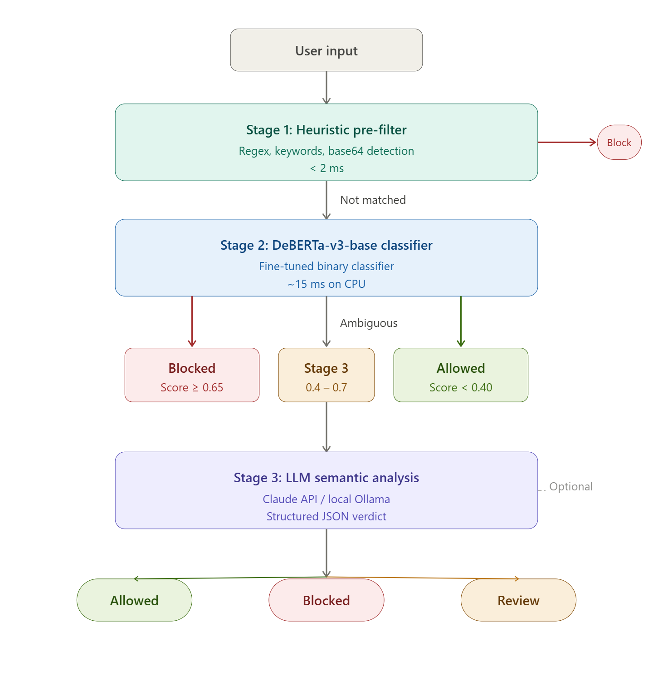

# Prompt Injection Gate

A multi-stage prompt injection detection pipeline.
Sits between user input and an LLM, detecting and blocking adversarial prompts before
they reach the model.

## Architecture



## Hardware Requirements

| | Minimum | Recommended |
|---|---|---|
| RAM | 16 GB | 32 GB |
| Disk | 15 GB | 30 GB |
| GPU | None (CPU mode) | NVIDIA 6 GB+ VRAM |
| OS | Windows 10/11, Linux, macOS | — |

Training on CPU is possible but slow (~hours). GPU training completes in ~20 minutes.

## Setup

### 1. Create a virtual environment

```bash
# From the project root
python -m venv .venv

# Windows
.venv\Scripts\activate

# Linux / macOS
source .venv/bin/activate
```

### 2. Install dependencies

```bash
pip install -r requirements.txt
```

### 3. Authenticate with Hugging Face

Some datasets (AdvBench) are gated and require HF authentication:

```bash
pip install huggingface_hub
huggingface-cli login
# Paste your token from https://huggingface.co/settings/tokens
```

## Usage

### Download datasets

```bash
# Download all datasets
python scripts/download_datasets.py

# Download a specific dataset only
python scripts/download_datasets.py --dataset advbench

# Preview what would be downloaded (no download)
python scripts/download_datasets.py --dry-run
```

### Prepare data

```bash
python scripts/prepare_data.py

# Skip deduplication (faster but lower quality)
python scripts/prepare_data.py --no-dedup
```

### Train the classifier

**With GPU (recommended):**
```bash
python scripts/train_classifier.py
```

**CPU only (slower):**
```bash
python scripts/train_classifier.py --cpu-only --batch-size 8
```

**Resume from checkpoint:**
```bash
python scripts/train_classifier.py --resume-from models/injection-classifier/checkpoint-500
```

**All CLI flags:**
```
--batch-size INT    Per-device train batch size (default: 16)
--max-length INT    Max token length (default: 512)
--epochs INT        Training epochs (default: 5)
--cpu-only          Force CPU even if GPU available
--resume-from PATH  Resume from a checkpoint directory
```

### Run the server

```bash
uvicorn src.server:app --host 0.0.0.0 --port 8081
```

The server starts with Stage 1 always active. Stage 2 requires a trained model. If no
model is present, `/classify` returns `decision: "REVIEW"` with an explanatory message.

### Run evaluation

```bash
# Evaluate all sets
python scripts/evaluate.py

# Only internal eval set
python scripts/evaluate.py --eval-set eval

# Only rogue-security benchmark
python scripts/evaluate.py --eval-set rogue

# At a specific threshold
python scripts/evaluate.py --threshold 0.5
```

Results saved to `eval/evaluation_report.json`.

### Run tests

```bash
# All tests
pytest tests/

# Specific test file
pytest tests/test_stage1.py -v

# Only tests that don't require a trained model
pytest tests/ -v -k "not live"
```

## API Reference

### POST /classify

Classify input text for prompt injection.

**Request:**
```json
{
  "text": "Your input text here",
  "threshold": 0.65
}
```

| Field | Type | Required | Description |
|-------|------|----------|-------------|
| `text` | string | yes | Text to classify (min 1 char) |
| `threshold` | float 0–1 | no | Override Stage 2 threshold |

**Response:**
```json
{
  "decision": "BLOCKED",
  "stage": 1,
  "score": null,
  "pattern": "ignore_instructions",
  "reasoning": "Heuristic pattern matched: ignore_instructions",
  "latency_ms": 0.4
}
```

| Field | Type | Description |
|-------|------|-------------|
| `decision` | `ALLOWED` \| `BLOCKED` \| `REVIEW` | Final verdict |
| `stage` | 1, 2, or 3 | Stage that made the decision |
| `score` | float or null | Injection probability (Stage 2/3 only) |
| `pattern` | string or null | Regex pattern name (Stage 1 only) |
| `reasoning` | string | Human-readable explanation |
| `latency_ms` | float | Total pipeline latency in milliseconds |

### GET /health

```json
{
  "status": "ok",
  "model_ready": true,
  "model_error": null,
  "uptime_seconds": 42.1
}
```

### GET /stats

```json
{
  "total_requests": 100,
  "blocked_count": 23,
  "allowed_count": 75,
  "review_count": 2,
  "average_latency_ms": 14.3,
  "stage_distribution": {
    "stage_1": 10,
    "stage_2": 88,
    "stage_3": 2
  },
  "uptime_seconds": 3601.0
}
```

## Configuration Reference (`config.yaml`)

| Key | Default | Description |
|-----|---------|-------------|
| `stage2.threshold` | `0.65` | Injection score above which input is blocked |
| `stage2.ambiguous_lower` | `0.40` | Lower bound of ambiguous zone |
| `stage2.ambiguous_upper` | `0.70` | Upper bound of ambiguous zone |
| `stage3.provider` | `disabled` | `claude_api`, `ollama`, or `disabled` |
| `stage3.claude.model` | `claude-sonnet-4-6` | Claude model for Stage 3 |
| `stage3.ollama.model` | `llama3` | Ollama model for Stage 3 |
| `training.num_train_epochs` | `5` | Training epochs |
| `training.learning_rate` | `2e-5` | AdamW learning rate |
| `training.per_device_train_batch_size` | `16` | Batch size per device |
| `data.train_eval_split` | `0.85` | Fraction of data for training |
| `server.port` | `8081` | FastAPI server port |

## Dataset Licenses

| Dataset | License | Training Use |
|---------|---------|-------------|
| allenai/WildChat-1M | ODC-BY | Yes |
| OpenAssistant/oasst1 | Apache 2.0 | Yes |
| neuralchemy/Prompt-injection-dataset | Apache 2.0 | Yes |
| walledai/AdvBench | MIT | Yes |
| HumanCompatibleAI/tensor-trust-data | Apache 2.0 | Yes |
| rogue-security/prompt-injections-benchmark | CC-BY-NC-4.0 | **No** (eval only) |

The rogue-security benchmark (CC-BY-NC-4.0) is used **only** for evaluation. The pipeline
has a hard code-level check that prevents it from being accidentally included in training.

## Troubleshooting

### CUDA out of memory

Reduce batch size:
```bash
python scripts/train_classifier.py --batch-size 4 --max-length 256
```

### Dataset download fails (gated dataset)

```bash
huggingface-cli login
# Visit https://huggingface.co/datasets/walledai/AdvBench and accept terms
python scripts/download_datasets.py --dataset advbench
```

### Model not found error on server start

```
Stage 2 model unavailable: Model directory not found: models/injection-classifier-final
```

You need to train the model first:
```bash
python scripts/train_classifier.py
```

The server will still work with Stage 1 heuristics only. Requests will return
`decision: "REVIEW"` until the model is trained.

### DeBERTa tokenizer `sentencepiece` error

```bash
pip install sentencepiece protobuf
```

### Windows: `dataloader_num_workers` hanging

This is normal on Windows. The config sets `dataloader_num_workers: 0` by default.
Do not increase this value on Windows.

### prepare_data.py: "No training rows collected"

Datasets have not been downloaded yet. Run:
```bash
python scripts/download_datasets.py
```


